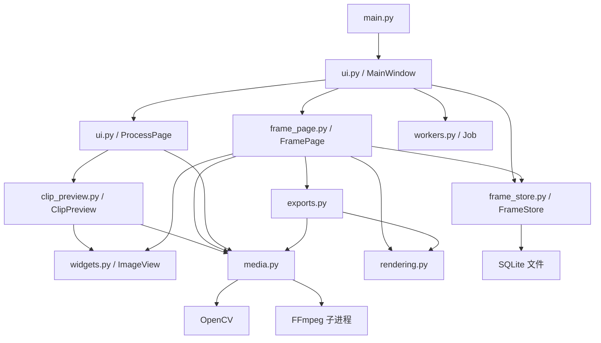
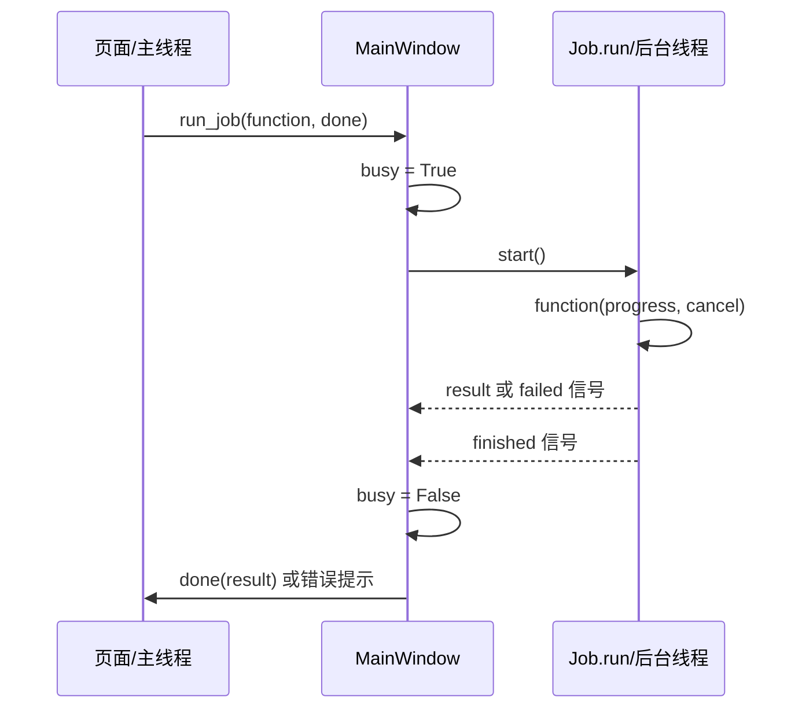

# 帧析：项目架构与代码学习指南

本文帮助你理解当前项目，并学习如何从一个空目录逐步创建类似程序。讲解以 v0.2.0 源码为准，包含亮度审查、稳定的时间轴定位和可视化剪辑。

建议你具备最基本的 Python 阅读能力：变量、函数、类、列表、字典、异常和模块导入。不熟悉的语法可结合第 4 节理解。第一次阅读不需要记住所有代码，先跟通“导入视频 → 显示一帧 → 标记 → 导出”这条流程。

## 1. 先明确我们在创建什么

当前应用有三个功能页面：

| 页面 | 用户操作 | 核心输入与输出 |
| --- | --- | --- |
| 帧标记与导出 | 看视频、定位帧、标记、导出图片；暂停时查看像素亮度 | 视频 → PNG/JPG |
| 视频剪辑 | 设置起止时间，截取一个片段 | 视频和时间范围 → 新视频 |
| 格式转换 | 选择输出格式 | 视频和输出格式 → 新视频 |

当前“标记帧”只表示选中要导出的帧，不表示画框或给算法结果下审核结论。旧审核模块、检测文件导入、问题统计和 Excel/CSV 导出已经移除，不应再按旧版本理解代码。

创建项目之前，先把需求写成几个能够观察结果的动作：

> 导入一段视频，显示第 55 帧，标记它，重启后还能看到这个标记，最后导出对应图片。

这比一开始就设计大量抽象类更容易检验实现是否正确。

## 2. 先运行，再阅读

在 PowerShell 中进入根目录：

```powershell
Set-Location 'D:\vscode.code\Tool'
python main.py
```

也可以双击 [启动Demo.cmd](D:/vscode.code/Tool/启动Demo.cmd)。它优先使用项目 `.venv` 中的解释器，否则使用 PATH 中的 `python`。

先完成一次体验：

1. 点击“载入演示视频”。
2. 跳转第 55 帧，勾选“标记当前帧用于导出”。
3. 导出 PNG，确认它对应当前画面。
4. 暂停后开启“亮度审查”，在画面内停留 0.2 秒。
5. 播放视频，观察亮度审查按钮自动关闭并禁用。
6. 重启应用，点击“恢复上次任务”。

在新电脑或独立练习环境中，先创建虚拟环境再安装依赖：

```powershell
python -m venv .venv
.venv\Scripts\python -m pip install -r requirements.txt
.venv\Scripts\python main.py
```

这组命令不要求激活虚拟环境，因为明确指定了其解释器路径。不要为了学习直接覆盖当前项目；可以在另一个练习目录逐步重建。

当前电脑曾验证的现有环境是 Python 3.7 与 PyQt5；这是一项本机运行记录，不代表新环境应照搬旧版本。依赖文件使用版本范围，尚未提供完整锁定文件，新环境需安装后重新验证。

## 3. 文件地图：每个文件解决什么问题

```text
D:\vscode.code\Tool
├── main.py                    应用启动
├── requirements.txt           第三方依赖
├── 启动Demo.cmd                Windows 启动脚本
├── media_tool
│   ├── ui.py                  主窗口、剪辑页面、转换页面
│   ├── frame_page.py          帧标记页面及操作流程
│   ├── widgets.py             视频画面控件、亮度悬停提示、时间轴
│   ├── clip_preview.py        剪辑预览、选区及区间播放
│   ├── media.py               视频信息、帧解码、FFmpeg 转换
│   ├── rendering.py           OpenCV 帧转为 Qt 图片
│   ├── frame_store.py         标记及位置的数据库读写
│   ├── exports.py             已标记帧导出
│   ├── workers.py             后台任务
│   └── demo.py                生成演示视频
├── tests/test_demo.py         自动化测试
├── tests/test_revision.py     时间轴、右栏稳定性和可视化剪辑回归测试
├── .demo-data/                本地运行数据，不提交 Git
├── .local/                    本机依赖路径，不提交 Git
└── test-output/               测试截图，不提交 Git
```

三个文档的用途不同：[README.md](D:/vscode.code/Tool/README.md) 用来运行程序，[需求方案](D:/vscode.code/Tool/首版需求方案.md) 说明做什么，本文说明代码如何工作以及如何重建。

### 3.1 调用关系图



图中的箭头表示使用关系，不完全等同于 Python 的 `import`。例如 `FramePage` 通过主窗口的 `store` 属性使用数据库，而不是自己创建另一份数据库连接。

### 3.2 为什么这样拆分

修改图片保存格式，主要看 `exports.py`；修改亮度提示，主要看 `widgets.py`；修改视频编码，主要看 `media.py`。修改点集中，其他调用者继续使用原接口。

这就是在本项目中理解“高内聚、低耦合”的具体方式：有关联的逻辑放在一起，其他模块通过少量接口使用它，而不是到处访问它的内部细节。

当前代码没有严格套用 MVC 或 MVVM。`MainWindow` 负责组装和后台任务协调，`FramePage` 仍承担部分流程控制，这是 Demo 的务实取舍，不应将它理解成已经彻底解耦的完整框架。

## 4. 读代码前认识几个 Python 与 Qt 概念

| 概念 | 在项目中的例子 | 如何理解 |
| --- | --- | --- |
| 类与对象 | `FrameStore`、`self.store` | 类描述能力，对象保存这次运行的具体状态 |
| `self` | `self.index` | 当前对象正在查看的帧号 |
| 字典 | `task['info']`、`task['key']` | 一项任务的具名数据 |
| `@dataclass` | `VideoInfo` | 集中声明一组字段，自动获得初始化等基础方法 |
| `@property` | `VideoInfo.duration` | 像读属性一样调用计算逻辑，不必维护第二份时长值 |
| 回调 | `done(result)` | 工作结束后要执行的函数 |
| `lambda` | `lambda: self.step(1)` | 用短函数把参数绑定到一个操作 |
| `with` | `with self.db:` | 在一个明确范围内管理事务；不是所有 `with` 都表示关闭资源 |
| `try/finally` | `cap.release()` | 无论成功还是异常，都要释放视频句柄 |
| 信号与槽 | `clicked.connect(callback)` | 控件发出事件后，Qt 调用对应函数 |

例如：

```python
button('下一帧', nav, lambda: self.step(1))
```

这里没有立即执行 `step(1)`；传入的是一个以后点击按钮时才执行的函数。若错误地传入 `self.step(1)`，就会在创建页面时执行操作，而不是等待用户点击。

## 5. 程序从哪里开始

打开 [main.py](D:/vscode.code/Tool/main.py)，重点读 `main()`：

```python
app = QApplication(sys.argv)
window = MainWindow(Path(__file__).resolve().parent)
window.show()
return app.exec_()
```

这是当前入口的简化摘录，省略了名称和样式设置。

- `QApplication` 管理应用事件处理。
- `MainWindow` 创建页面、存储对象和其他运行状态。
- `show()` 显示窗口。
- `exec_()` 进入事件循环，持续处理点击、鼠标移动、定时器和后台结果。

`Path(__file__).resolve().parent` 获取入口脚本所在目录，因此运行数据的位置不依赖从哪个目录启动 Python。

继续读 [ui.py](D:/vscode.code/Tool/media_tool/ui.py) 的 `MainWindow.__init__()`，你会看到它创建 `FrameStore`、`FramePage` 和两个 `ProcessPage`，再放进 `QTabWidget`。

剪辑与格式转换共用 `ProcessPage`。参数 `clipping=True` 时增加起止时间输入及 `ClipPreview` 预览组件，避免复制两套输出设置和执行逻辑。`ClipPreview` 管理画面、定位、选区和播放，通过 `rangeChanged` 信号通知页面更新起止时间，复用已有的 `FrameReader`、`ImageView` 和 `TimelineSlider`。

## 6. 跟踪一次“导入视频”

在 [frame_page.py](D:/vscode.code/Tool/media_tool/frame_page.py) 中按以下顺序阅读：

```text
import_files()
  → 文件对话框得到路径
  → import_paths(paths)
  → 后台 inspect_video(path, frame_limits=True)
  → 后台 fingerprint(path)
  → imported(result)
  → store.register(key, path)
  → 更新视频列表
  → switch_task(row)
  → request_frame(index)
```

一次导入得到的任务结构是：

```python
task = {
    'info': VideoInfo(...),
    'key': '视频内容的 SHA-256 摘要'
}
```

`VideoInfo` 保存路径、宽高、FPS 和帧数；`key` 用来关联本地标记。

为什么用内容摘要？两个路径下的相同内容可以识别为同一视频，避免仅按文件名关联错记录。相应代价是导入时要读取视频内容计算摘要；目前内容完全相同的两个文件也会被当成同一个任务。

`inspect_video()` 的 `frame_limits=True` 只用于帧标记流程。剪辑与转换不传这个开关，因此不受到同一组三分钟、2K 限制。文件扩展名能出现在选择器中，不代表其内部编码一定可被本地解码器读取。

## 7. 一帧怎样变成屏幕上的画面

核心流程是：

```text
FrameReader.read(index)
  → OpenCV BGR 数组
  → rendering.to_image(frame)
  → RGB QImage
  → ImageView.set_image(image)
  → QPixmap 放进图形场景
  → QGraphicsView 显示
```

### 7.1 为什么有 BGR → RGB 转换

本项目从 OpenCV 获得的帧按 BGR 通道排列，传给 Qt 的格式声明为 RGB888，因此 [rendering.py](D:/vscode.code/Tool/media_tool/rendering.py) 显式转换通道顺序。忽略它会造成颜色错误，例如红蓝互换。

`QImage(...).copy()` 同样值得注意：构造时先引用 NumPy 数据缓冲区，随后复制图片，使返回图片拥有独立数据，不依赖函数结束后局部数组的生命周期。

### 7.2 为什么不把整段视频全部读入内存

一帧 2560×1440、三通道、每通道一字节的像素约占 10.5 MiB。三分钟、30 FPS 有 5400 帧，仅这些像素就需要约 55.6 GiB，尚未计入其他开销。

因此 [media.py](D:/vscode.code/Tool/media_tool/media.py) 的 `FrameReader` 按需读取，使用 `OrderedDict` 保存近期请求的帧，缓存目标上限约 48 MiB。这不是整个进程的内存上限：解码器、当前画面、QImage 和 QPixmap 也会占用内存。

读取逻辑分三种情况：

| 情况 | 当前处理 |
| --- | --- |
| 缓存命中 | 直接返回，并更新最近使用顺序 |
| 目标在当前解码位置之后 | 顺序前进，中间帧用 `grab()`，目标帧用 `read()` |
| 目标在解码位置之前且未命中缓存 | 重新打开视频，从头前进到目标帧 |

这是准确性优先的实现，代价是反向跳转可能慢。不要把它误解成已经实现高效随机访问；未来优化应保留与顺序解码结果对比的测试。

## 8. 为什么界面没有在读取视频时卡住

窗口响应事件需要主线程继续处理事件循环。如果直接在按钮回调中执行长时间解码或编码，窗口就可能无法及时重绘和响应。

当前把耗时操作交给 [workers.py](D:/vscode.code/Tool/media_tool/workers.py) 的 `Job`，由 [ui.py](D:/vscode.code/Tool/media_tool/ui.py) 的 `run_job()` 统一协调。



阅读时注意四点：

1. `Job.start()` 启动线程；直接调用 `Job.run()` 并不能得到同样的异步效果。
2. `function` 做工作，`done` 更新界面，二者职责不同。
3. 当前使用全局 `busy`，同一时间只执行一个这种后台任务。
4. 后台任务返回图片数据，主线程负责把结果放到界面；不要从后台直接操作按钮、列表或窗口。

### 时间轴为什么需要区分用户定位与播放更新

`TimelineSlider` 用 `seekRequested` 表示用户点击、拖动或键盘定位；`set_frame_value()` 则负责播放时更新进度，并阻断信号。用户开始定位先暂停播放，鼠标拖动期间不允许解码结果反向移动滑块，避免两种更新相互干扰。

解码忙碌时，页面只保存最后一次请求。任务结束后，`MainWindow.job_idle` 触发页面处理该请求；结果携带视频身份和帧号，页面丢弃旧视频或已被新定位替代的结果。这样连续点击不会因 `busy` 而丢失最终目标，也不会无限堆积请求。

逐帧读取不再反复禁用右栏和视频列表。`show_frame()` 只更新画面、帧号和当前标记状态；标记列表仅在视频切换或标记变化时刷新。同尺寸画面更新也不重复执行适应窗口，减少不必要的界面变化。

Qt 的 GUI 对象与线程归属规则可阅读 [Qt Threads and QObjects](https://doc.qt.io/qt-6/threads-qobject.html)。该链接为 Qt 6 文档，适合阅读原则；本项目使用 PyQt5，具体代码以本地接口为准。

**当前实现的取舍：**每次任务创建一个新的 `Job`，而 `FrameReader` 在任务间复用；依靠 `busy` 保证串行访问，不是一个永久视频线程在持有读取器。后续做连续高帧率播放，可考虑持久工作线程，但不能直接把当前读取器交给多个并发任务。

## 9. 标记如何保存，为什么重启后还在

打开 [frame_store.py](D:/vscode.code/Tool/media_tool/frame_store.py)。数据库只有两张业务表：

| 表 | 字段 | 用途 |
| --- | --- | --- |
| `videos` | `id`, `path`, `position` | 视频身份、路径及上次查看位置 |
| `marks` | `video`, `frame` | 某视频中哪些帧被标记 |

`marks` 的联合主键是 `(video, frame)`。同一视频同一帧只能有一条标记，所以反复勾选不会产生重复记录。

```text
复选框变化
  → FramePage.save_mark()
  → FrameStore.set_mark(key, index, selected)
  → 选中时 INSERT OR IGNORE
  → 取消时 DELETE
  → 提交事务
  → 更新已标记帧列表
```

`with self.db:` 在正常结束时提交事务，异常时回滚；它并不代替 `close()`。SQL 使用 `?` 绑定参数，不拼接文件路径等输入。参考 [Python sqlite3 文档](https://docs.python.org/3/library/sqlite3.html)。

当前数据库连接在主线程创建并使用。不要直接把 `self.store` 放进后台函数里调用；如果以后要把数据库操作后台化，应另外设计连接归属。

还有一个容易忽略的状态：`FramePage.loading`。显示新帧时，程序会主动设置复选框。这也会触发信号；`loading` 用来防止把“刷新界面”误当成“用户修改标记”。

恢复流程是读取保存的视频路径，再走正常导入与内容身份校验，最后读取该视频的位置和标记。文件移动后原路径失效不会被自动搜索找回；重新导入内容相同的文件时，可用相同内容摘要关联既有记录。

## 10. 图片导出为什么不会把按钮和黑边一起导出

因为导出没有截取窗口。

[exports.py](D:/vscode.code/Tool/media_tool/exports.py) 的 `export_images()` 创建独立的 `FrameReader`，重新读取已标记的帧，再保存原分辨率图片。

```text
store.marked(key) → 帧号列表快照
  → 校验、排序、去重
  → 逐帧读取
  → to_image()
  → QImage.save()
```

这样，窗口尺寸、缩放、平移和亮度提示都不会进入图片。PNG 可用于保留解码后的像素，JPG 是有损输出，不应要求二者像素逐点相同。

独立读取器也防止导出操作改变当前播放器的读取位置。若中途导出失败，之前成功保存的图片可能已经存在；当前图片批量导出不是全部成功或全部回滚的事务。

## 11. 亮度审查：用一个小功能理解事件、坐标和状态

这个功能跨两个文件，但职责清楚：

- `FramePage` 决定什么时候允许开启。
- `ImageView` 负责指针停留、像素定位、数值计算和提示。

### 11.1 0.2 秒停留怎样实现

`ImageView` 使用单次 `QTimer`，间隔为 200 毫秒：

```text
鼠标移动
  → cancel_hover() 清除旧计时和提示
  → schedule_hover(position) 记录位置并重新计时
  → 200ms 内没有新移动
  → show_brightness() 显示提示
```

不能在鼠标事件里写 `time.sleep(0.2)`，那会阻塞主线程。定时器让等待发生在事件循环中；当前选择 `PreciseTimer` 避免提前触发，但系统繁忙时仍可能延后，不应理解成实时系统保证。参考 [Qt QTimer 文档](https://doc.qt.io/qt-6/qtimer.html)。

### 11.2 为什么不能直接使用鼠标坐标索引图片

鼠标坐标属于控件，图片可能已缩放、平移并带有周围黑边。`image_pixel()` 按以下顺序转换：

```text
视口坐标
  → mapToScene()
  → 图形场景坐标
  → item.mapFromScene()
  → 图片局部坐标
  → floor 取整
  → 检查是否处于原图范围
```

落在图片之外就不显示数值，避免将窗口黑边当成原图黑色像素。

### 11.3 “亮度”在本项目中的定义

当前代码对原图 RGB 计算：

```python
value = int(0.299 * R + 0.587 * G + 0.114 * B + 0.5)
```

输出范围 0–255。纯黑为 0，纯白为 255，纯红约为 76。这是应用采用的加权灰度定义，不是显示器的物理亮度，也不是对 HDR、线性光照或完整色彩管理的测量。

### 11.4 播放时为何无法开启

`refresh_brightness()` 的核心条件是：

```python
available = self.frame_ready and not self.timer.isActive()
```

| 状态 | 按钮 | 审查模式 |
| --- | --- | --- |
| 没有视频或帧未加载完成 | 禁用 | 关闭 |
| 已加载、暂停 | 可操作 | 用户决定 |
| 正在播放 | 禁用 | 强制关闭 |
| 切换帧 | 加载期间禁用 | 关闭，完成后需重新开启 |

这里有两层保护：按钮状态限制用户操作，`set_brightness()` 再检查业务条件，防止程序调用绕过按钮状态。这种“界面限制 + 操作检查”也可用于导出、删除、提交等功能。

## 12. 剪辑与格式转换为什么可以共用实现

剪辑页先由 `ClipPreview` 提供可视化选择：点击时间轴定位，用按钮设置起点和最后保留帧，并通过“预览选区”检查结果。右侧秒数与选区双向同步，时间轴以绿色标出范围。

帧号从 0 开始。对固定帧率视频，设第 `i` 帧为起点时使用 `i / fps`；设第 `j` 帧为最后保留帧时使用 `(j + 1) / fps` 作为终点。因此既能保留用户看到的终点帧，又保持底层“起点包含、终点不包含”的约定。例如 24 FPS 视频选择第 24～47 帧，对应 `[1, 2)` 秒，输出 24 帧。可变帧率精确时间戳仍是后续工作。

两者最终都调用 `media.py` 的 `transcode()`：

```python
# 示意调用：假设 source、destination 已由用户选择
transcode(source, destination)                  # 转换完整视频
transcode(source, destination, start=1, end=3)  # 截取 1～3 秒
```

界面通过 `Job` 在后台调用；不要将上面的同步示例直接放进按钮回调。

理解该函数时可以分成五段：

1. **验证参数**：输入可读，输出格式受支持，不覆盖原文件，时间范围有效。
2. **准备临时文件**：工作结果先写临时路径，不把未完成内容作为最终文件。
3. **构造参数列表**：选择视频流、可选音轨、编码器，以及可选的起点和时长。
4. **启动子进程**：读取进度，监听取消请求，收集错误。
5. **结束处理**：验证输出可读取，重命名；失败则清理临时文件。

这里直接复用 FFmpeg，不自己实现视频编码。`subprocess.Popen()` 接收参数列表，各路径作为独立参数传入，不靠拼接一整条 shell 字符串处理引号。

取消使用 `threading.Event` 表达“请求取消”。一个小监听线程会检查该事件并终止 FFmpeg，因此即使暂时没有进度输出，也能响应取消。它没有把程序所有操作都变成可取消任务；当前图片导出没有同样的取消入口。

## 13. 从零重建：建议按这个顺序练习

这是建议的学习顺序，不是要求一次写完所有文件。每一步先得到可验证结果，再进入下一步。

| 步骤 | 本次只完成什么 | 对照源码 | 完成标准 |
| --- | --- | --- | --- |
| 1 | 创建虚拟环境、验证依赖导入 | `requirements.txt` | 可以导入 PyQt5、cv2、numpy |
| 2 | 创建一个能关闭的空窗口 | `main.py` | 窗口可显示、移动和关闭 |
| 3 | 创建三个空标签页 | `MainWindow` | 能切换页面 |
| 4 | 读取一个视频的基础信息 | `inspect_video()` | 打印宽、高、FPS、帧数 |
| 5 | 将视频首帧显示在窗口 | `to_image()`、`ImageView` | 颜色正确、比例正常 |
| 6 | 将视频读取放到后台 | `Job`、`run_job()` | 读取时窗口仍能响应 |
| 7 | 实现上一帧、下一帧和跳转 | `FramePage`、`FrameReader` | 帧号与画面一致 |
| 8 | 添加标记和取消操作 | `FrameStore` | 同一帧不重复，重启可恢复 |
| 9 | 导出已标记图片 | `export_images()` | 只导出选择帧，尺寸正确 |
| 10 | 加入播放状态和定时推进 | `toggle_play()`、`advance()` | 能暂停，不并发读取 |
| 11 | 加入亮度审查 | `ImageView` | 200ms 延迟、映射正确、播放禁用 |
| 12 | 接入可视化剪辑与格式转换 | `ClipPreview`、`ProcessPage`、`transcode()` | 选区可预览，输出范围正确，取消不留最终文件 |

第 2 步可以从下面这个独立示例开始。把它保存到你的练习目录中，不要覆盖本项目入口：

```python
import sys
from PyQt5.QtWidgets import QApplication, QLabel, QMainWindow

app = QApplication(sys.argv)
window = QMainWindow()
window.setWindowTitle('我的视频工具')
window.setCentralWidget(QLabel('下一步：在这里显示视频帧'))
window.resize(900, 600)
window.show()
sys.exit(app.exec_())
```

你不需要先写一个“万能任务系统”。先让视频能显示，再把实际出现的慢操作移到后台，再将复用点提取出来。

## 14. 如何验证自己真正理解了代码

### 练习 A：独立读取第 55 帧

在根目录 Python 交互环境中运行下面的独立示例。它调用现有模块，不启动主窗口：

```python
from pathlib import Path
from media_tool.demo import generate_sample
from media_tool.media import inspect_video, FrameReader

path = generate_sample(Path('.demo-data') / 'learning-sample')
info = inspect_video(path)
reader = FrameReader(path)
try:
    frame = reader.read(55)
    print(info.frame_count, frame.shape)
finally:
    reader.close()
```

预期帧数为 144，数组形状为 `(540, 960, 3)`。思考为什么数组的前两个维度是高、宽，而窗口尺寸常写成宽、高。

### 练习 B：只用内存数据库理解标记

```python
from media_tool.frame_store import FrameStore

store = FrameStore(':memory:')
try:
    store.register('example', 'example.mp4')
    store.set_mark('example', 55, True)
    store.set_mark('example', 55, True)
    print(store.marked('example'))  # [55]
    store.set_mark('example', 55, False)
    print(store.marked('example'))  # []
finally:
    store.close()
```

尝试在不看实现的情况下说明：为什么不需要在 Python 列表中手工查重？

### 练习 C：改变一个需求，并找到正确修改位置

在练习副本中尝试将亮度停留时间改为 0.5 秒。修改前先回答：要改视频读取、数据库，还是画面控件？修改后还要更新哪条时间测试？

### 自测问题

1. 为什么每次显示新帧时需要 `loading`？
2. 为什么导出不用 `window.grab()`？
3. 为什么“播放时禁用按钮”之外仍需要在函数中检查？
4. 为什么 `48 MiB` 不等于整个程序的内存上限？
5. 为什么 `busy=True` 不等于用户正在播放视频？

<details>
<summary>检查答案</summary>

1. 刷新复选框也会触发信号，需要区分程序刷新和用户修改。
2. 窗口截图包含缩放后的画面与控件，不能保证导出原始帧像素。
3. 函数可能被其他代码调用，状态规则不能只依赖按钮外观。
4. 解码器、图像副本、界面及其他对象也占内存。
5. 导入、单帧读取、导出和转换都可能让 `busy=True`；播放状态由播放定时器表达。

</details>

## 15. 测试是功能行为的另一份说明书

阅读 [tests/test_demo.py](D:/vscode.code/Tool/tests/test_demo.py)，优先看每个测试中的输入和断言，不必先研究全部测试工具。

再阅读 [tests/test_revision.py](D:/vscode.code/Tool/tests/test_revision.py)：它通过真实 Qt 鼠标事件验证时间轴，通过延迟解码验证最后请求和视频切换，监听列表重置与控件启用事件验证闪烁修复，并将可视化选区实际导出后检查时长和帧数。

| 测试主题 | 它保护的行为 |
| --- | --- |
| 非顺序读取帧 | 任意请求顺序的画面与顺序解码一致 |
| 标记保存与取消 | 去重、视频隔离、重新打开后仍存在 |
| Qt 标记导出与恢复 | 从文件选择到 PNG/JPG 输出的完整流程 |
| 非法导出与覆盖保护 | 拒绝越界帧和已有图片覆盖 |
| 亮度停留与坐标 | 不提前显示，移动重新计时，缩放后仍取正确像素 |
| 播放与亮度互斥 | 播放禁用，切帧清除，暂停不自动重新开启 |
| 剪辑与转换 | 实际输出时长、帧数、起点和格式可读取 |
| 音轨保留 | 剪辑结果中的音轨仍可解码 |

运行全部测试：

```powershell
python -m unittest discover -s tests -v
```

亮度测试使用 `QTest.qWait()` 等待 Qt 事件处理；这用于测试环境，不应照搬到正常按钮回调中。测试里的 `patch()` 模拟文件对话框返回值，避免每次验证都要求人手动选文件。

## 16. 当前架构值得继续改进的地方

学习架构时，要同时理解它解决了什么、还留下什么：

- **任务协调集中在主窗口**：简单直观，但全局 `busy` 限制并行能力；以后可根据真实需求提取任务调度模块。
- **页面访问主窗口服务**：便于 Demo 实现，但不是完全独立；后续可通过构造参数传入存储和任务执行接口。
- **新任务创建新线程**：实现简单；持续播放可以探索长期运行的视频工作线程。
- **时间由帧号除以 FPS 得到**：固定帧率可用，精确可变帧率需要使用解码时间戳。
- **反向读取可能从头开始**：优化前应建立时间戳/关键帧定位方案并保留准确性测试。
- **后台任务仍串行执行**：最新定位请求得到保留，但较慢的解码仍需等待；未来优化需保持帧定位准确性和媒体句柄的串行访问。
- **导出保存依赖 Qt 图片**：复用了现有能力；如果以后需要无 Qt 的命令行工具，再评估是否替换图片保存层。
- **依赖未完全锁定**：后续交付应记录并验证完整运行环境。

这些都是后续设计选项，不代表现在需要一次性重构。每次变更先找最小受影响模块，验证用户可见行为，再判断是否值得扩大设计。

## 17. 推荐阅读顺序

第一次：`main.py` → `MainWindow.__init__()` → `FramePage.import_files()` → `request_frame()` → `show_frame()`。

第二次：`FrameReader` → `to_image()` → `FrameStore` → `export_images()`。

第三次：`Job` → `MainWindow.run_job()` → `ImageView` 亮度相关方法 → `transcode()` → 测试。

读完一个函数后，尝试不看代码回答三个问题：**它接收什么？它改变或返回什么？出错时谁处理？** 能回答这三个问题，再进入下一层调用。

后续提问可以直接指定路径和函数，例如：“请逐行解释 `FramePage.request_frame()`，并让我补写一个练习版本。”这样可以围绕当前项目继续学习。
